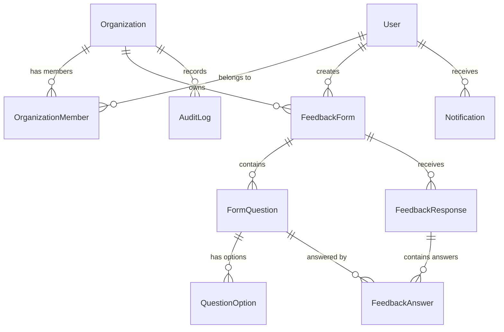

# 🚀 Feedback Collection System - Enterprise SaaS Platform

[](https://github.com/pavankalyanr02/Feedback-Collection-System/actions/workflows/ci.yml)
[](https://nodejs.org/)
[](https://react.dev/)
[](https://www.typescriptlang.org/)
[](https://www.prisma.io/)
[](LICENSE)

A production-grade, enterprise-ready **Feedback Collection & Analytics SaaS Platform** built from scratch using a modern TypeScript full-stack monorepo architecture. 

This platform empowers multi-tenant organizations to build dynamic feedback forms, capture authenticated or anonymous public submissions with duplicate rate-limiting protection, analyze real-time metric aggregations with visual Recharts dashboards, manage team members with Role-Based Access Control (RBAC), and export response datasets to CSV.

---

## 🌟 Key Product Features

### 🏢 Multi-Tenant Workspace & Role-Based Access Control (RBAC)
- **4 Granular Roles**: `ADMIN`, `MANAGER`, `MEMBER`, `RESPONDENT`.
- **Workspace Isolation**: Multi-tenant database architecture where forms, analytics, and audit logs are strictly scoped per organization.
- **Backend & Frontend Enforcement**: Authorization checks enforced at both React Router guards and Express API middleware layers.

### 📝 Dynamic Feedback Form Builder
- **10 Supported Question Types**:
  - `Star Rating` (Interactive 1–5 star widget)
  - `Rating` (1 to 10 scale)
  - `Single Choice` (Radio buttons)
  - `Multiple Choice` (Checkboxes)
  - `Dropdown` (Select list)
  - `Short Text` & `Long Text` (Text inputs & textareas)
  - `Yes / No` (Choice toggle)
  - `Number` & `Date` inputs
- **Form Configuration**: Required/optional flags, question description, ordering, options editor, form expiration date, one-submission-per-user constraint, and live preview tab.
- **Form Lifecycle States**: `DRAFT`, `PUBLISHED`, `CLOSED`.

### 🌐 Anonymous & Public Feedback Submissions
- **Unique Public URLs**: `/feedback/<public-form-id>` accessible without user login when anonymous feedback is enabled.
- **Rate-Limiting & Duplicate Prevention**: Protection against spam submissions via IP rate-limiting and user tracking.

### 📊 Real-Time Analytics & Response Management
- **Executive Dashboard**: Total forms, active forms count, total response volume, average CSAT score, and response trends.
- **Visual Charts**: Interactive rating distribution bar charts and daily submission trend line charts using **Recharts**.
- **Data Table & CSV Export**: Server-side paginated response table with response drawer modal and instant CSV export generator.
- **Audit Logs**: Comprehensive event stream capturing form publications, role modifications, and admin events.

---

## 🏗️ Technology Stack

| Layer | Technologies Used |
| :--- | :--- |
| **Frontend Framework** | React 18, TypeScript, Vite, React Router v6 |
| **Styling & UI** | Tailwind CSS, Glassmorphism SaaS Design System, Lucide React Icons |
| **State & Data Fetching** | TanStack React Query v5, React Hook Form, Zod, Axios |
| **Charts & Visualization** | Recharts |
| **Backend API Server** | Node.js, Express.js, TypeScript (Layered Controller-Service-Repository Pattern) |
| **ORM & Database** | Prisma ORM 5, PostgreSQL (Primary Production) / SQLite (Zero-setup Dev Fallback) |
| **Security & Authentication** | JWT Dual-Token (Access + Refresh), bcryptjs Password Hashing, Helmet, CORS, Express Rate Limit |
| **API Documentation** | Swagger UI (`/api-docs`) via OpenAPI 3.0 & `swagger-jsdoc` |
| **Logging** | Pino Logger (`pino-pretty`) |
| **Testing** | Jest, Supertest, Vitest |
| **Containerization & CI/CD**| Docker, Docker Compose, GitHub Actions |

---

## 📁 Repository Structure

```
feedback-collection-system/
├── backend/                        # Node.js Express & Prisma Backend
│   ├── prisma/
│   │   ├── schema.prisma           # Database Schema Definition
│   │   └── seed.ts                 # Database Seeding Script (Admin, Forms, Questions, Responses)
│   ├── src/
│   │   ├── config/                 # Env validation & Prisma database singleton
│   │   ├── controllers/            # Request handlers (Auth, Org, Form, Response, Analytics)
│   │   ├── middlewares/            # Auth, RBAC, Zod validator, Error handler, Rate limiters
│   │   ├── routes/                 # API Endpoint routes
│   │   ├── services/               # Core business logic layer
│   │   ├── swagger/                # OpenAPI spec definitions
│   │   ├── utils/                  # AppError, apiResponse, jwt, logger
│   │   ├── app.ts                  # Express App configuration
│   │   └── server.ts               # Server bootstrap & process lifecycle
│   ├── tests/                      # Jest & Supertest Integration Tests
│   ├── Dockerfile
│   ├── tsconfig.json
│   └── package.json
│
├── frontend/                       # React + Vite + Tailwind CSS Frontend
│   ├── src/
│   │   ├── api/                    # Axios client with automatic JWT token interceptors
│   │   ├── components/             # Reusable UI components (Sidebar, Header, Cards, Badges, Charts)
│   │   ├── context/                # AuthContext & ThemeContext (Light/Dark mode)
│   │   ├── pages/                  # DashboardPage, FormsPage, FormBuilderPage, PublicFormPage, etc.
│   │   ├── routes/                 # AppRoutes with ProtectedRoute RBAC guards
│   │   ├── types/                  # TypeScript interface definitions
│   │   ├── App.tsx
│   │   └── main.tsx
│   ├── Dockerfile
│   ├── nginx.conf                  # Production Nginx web server config
│   ├── tailwind.config.js
│   ├── vite.config.ts
│   └── package.json
│
├── .github/workflows/ci.yml         # Automated GitHub Actions Workflow
├── docker-compose.yml              # Multi-container Orchestration (Postgres, Redis, Backend, Frontend)
├── .env.example                    # Environment Configuration Template
├── package.json                    # Root Monorepo Scripts
└── README.md                       # Project Documentation
```

---

## 🗄️ Database Schema & Entities

The database is modeled using Prisma ORM with strict foreign keys, cascade rules, and indexes:



---

## 🔌 API Endpoints Summary

Interactive Swagger / OpenAPI UI is accessible at **`http://localhost:5000/api-docs`**.

### Authentication & User Profile
| Method | Endpoint | Access | Description |
| :--- | :--- | :--- | :--- |
| `POST` | `/api/v1/auth/register` | Public | Register user & create default workspace |
| `POST` | `/api/v1/auth/login` | Public | Authenticate user & return JWT tokens |
| `POST` | `/api/v1/auth/refresh` | Public | Obtain new access token using refresh token |
| `POST` | `/api/v1/auth/logout` | Authenticated | Revoke user tokens |
| `GET`  | `/api/v1/auth/me` | Authenticated | Get current authenticated user profile |

### Organizations & Workspaces
| Method | Endpoint | Access | Description |
| :--- | :--- | :--- | :--- |
| `GET`  | `/api/v1/organizations` | Authenticated | List organizations user belongs to |
| `POST` | `/api/v1/organizations` | Authenticated | Create a new organization workspace |
| `GET`  | `/api/v1/organizations/:id/members` | RBAC (`MEMBER`+) | List workspace team members |
| `POST` | `/api/v1/organizations/:id/members` | RBAC (`ADMIN`) | Add user to workspace with assigned role |

### Feedback Form Management
| Method | Endpoint | Access | Description |
| :--- | :--- | :--- | :--- |
| `GET`  | `/api/v1/forms` | Authenticated | Paginated forms list with search & status filter |
| `POST` | `/api/v1/forms` | RBAC (`MANAGER`+) | Create a new feedback form with questions |
| `GET`  | `/api/v1/forms/:id` | Authenticated | Get form details with questions & options |
| `PUT`  | `/api/v1/forms/:id` | RBAC (`MANAGER`+) | Update form title, description, or questions |
| `DELETE`|`/api/v1/forms/:id` | RBAC (`ADMIN`) | Delete feedback form |
| `POST` | `/api/v1/forms/:id/publish` | RBAC (`MANAGER`+) | Change form status to `PUBLISHED` |
| `POST` | `/api/v1/forms/:id/duplicate` | RBAC (`MANAGER`+) | Duplicate form structure |

### Public Submissions (Respondents)
| Method | Endpoint | Access | Description |
| :--- | :--- | :--- | :--- |
| `GET`  | `/api/v1/public/forms/:publicId` | Public | Fetch public form layout for respondent |
| `POST` | `/api/v1/public/forms/:publicId/responses` | Public (Rate Limited) | Submit feedback answers |

### Response Management & Analytics
| Method | Endpoint | Access | Description |
| :--- | :--- | :--- | :--- |
| `GET`  | `/api/v1/forms/:id/responses` | RBAC (`MANAGER`+) | Paginated form responses |
| `DELETE`|`/api/v1/forms/:id/responses/:rId`| RBAC (`ADMIN`) | Delete specific feedback response |
| `GET`  | `/api/v1/analytics/dashboard` | Authenticated | Executive dashboard overview metrics |
| `GET`  | `/api/v1/forms/:id/analytics` | Authenticated | Question-by-question metrics breakdown |

---

## ⚡ Quick Start Guide (Local Development)

### Prerequisites
- **Node.js**: `v20.0.0` or higher
- **npm**: `v10.0.0` or higher

### 1. Clone & Install Dependencies
```bash
git clone https://github.com/pavankalyanr02/Feedback-Collection-System.git
cd Feedback-Collection-System

# Install root dependencies
npm install

# Install backend dependencies
cd backend && npm install && cd ..

# Install frontend dependencies
cd frontend && npm install && cd ..
```

### 2. Setup Environment Variables
Copy `.env.example` to `backend/.env`:
```bash
cp .env.example backend/.env
```

### 3. Initialize & Seed Database
```bash
cd backend
npx prisma db push
npx prisma db seed
cd ..
```

### 4. Start Development Servers
Run both backend Express server (`port 5000`) and frontend Vite server (`port 5173`) concurrently:
```bash
npm run dev
```

Open **`http://localhost:5173`** in your browser!

### 🔑 Demo Portfolio Credentials:
- **Admin**: `admin@feedback.com` / `Password123!`
- **Manager**: `manager@feedback.com` / `Password123!`
- **Member**: `member@feedback.com` / `Password123!`

---

## 🐳 Docker Deployment

To launch the complete production environment (PostgreSQL database, Redis cache, Node.js backend, and Nginx frontend) with a single command:

```bash
docker compose up -d
```

Access services:
- **Frontend App**: `http://localhost:5173`
- **Backend API**: `http://localhost:5000`
- **Swagger Documentation**: `http://localhost:5000/api-docs`

---

## 🧪 Automated Testing

### Backend Integration Tests (Jest + Supertest)
```bash
cd backend
npm test
```

### Frontend Build Verification
```bash
cd frontend
npm run build
```

---

## 🔒 Security Best Practices

1. **Password Hashing**: Passwords stored using `bcryptjs` with salt rounds = 10.
2. **Stateless JWT Flow**: 15-minute Access Tokens + 7-day HttpOnly Refresh Tokens.
3. **HTTP Security Headers**: Express app secured with **Helmet** (CSP, HSTS, X-Content-Type-Options).
4. **Rate Limiting**: `express-rate-limit` prevents brute-force login attempts and DDoS submission spam.
5. **Prisma Parameterized Queries**: Complete protection against SQL injection vulnerabilities.
6. **Input Validation**: All API payloads, URL route params, and query strings validated with **Zod** schemas.

---

## 👨‍💻 Portfolio & Placement Summary

**Developer**: Pavan Kalyan R  
**Degree**: Master of Computer Applications (MCA)  
**Project Goal**: Full-Stack Production SaaS Showcase  

### Technical Capabilities Demonstrated:
- Designing scalable multi-tenant database models using Prisma & PostgreSQL.
- Building RESTful APIs following Clean Layered Architecture (Controller-Service-Repository pattern).
- Enforcing Role-Based Access Control (RBAC) across full-stack boundaries.
- Designing responsive, high-performance React application state management with TanStack Query & React Hook Form.
- Implementing real-time chart visualizations with Recharts and dark-mode glassmorphism styling with Tailwind CSS.
- Automated API integration testing, Docker containerization, and GitHub Actions CI/CD.

---

## 📄 License

This project is licensed under the [MIT License](LICENSE).
